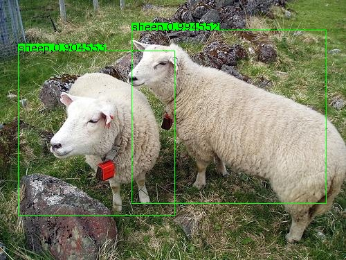
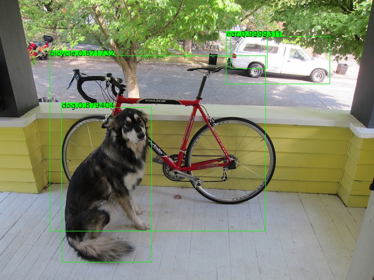
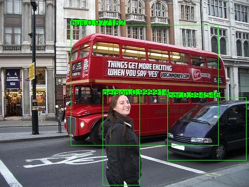
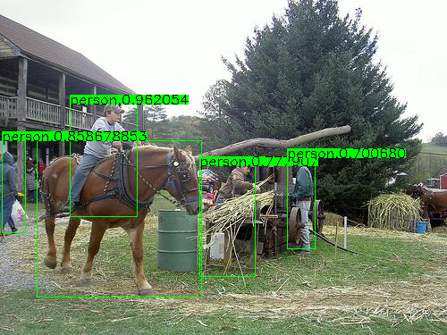

# MobileNet(V2)-SSD Caffe

**This is an experimental, linux version from my git [MobileNetSSD](https://github.com/eric612/MobileNet-SSD-windows)


### Running Caffe with MobilenetSSD_V2

```
> cd $caffe_root/
> sh demo.sh
```
### Running Caffe with MobilenetYOLO_V2

```
> cd $caffe_root/
> sh demo_yolo.sh
```

### MobilenetYOLO_V2 Result







#### Python Usage

```
> cd $caffe_root
> python examples\ssd\test_ssd.py data\VOC0712\000166.jpg models\MobileNet\MobileNetSSD_deploy.prototxt models\MobileNet\MobileNetSSD_deploy.caffemodel
```

If load success , you can see the image window like this 




### Trainning Prepare

Download [lmdb](https://drive.google.com/open?id=19pBP1NwomDvm43xxgDaRuj_X4KubwuCZ)

Unzip into $caffe_root/ 

Please check the path exist "$caffe_root\examples\VOC0712\VOC0712_trainval_lmdb"


### Trainning MobilnetSSD_V2
  
```
> cd $caffe_root/
> sh train.sh
```

### Trainning MobilnetYOLO_V2
  
```
> cd $caffe_root/
> sh train_yolo.sh
```

#### Trainning own dataset and deploy MobilentSSD_V1

follow this [project](https://github.com/chuanqi305/MobileNet-SSD) step

### Video Demo

```
> cd $caffe_root/
> sh demo_video.sh
```

#### MobilnetSSD
[](https://www.youtube.com/watch?v=9REYv5H3WMw)

#### MobilnetSSD_V2

[](https://www.youtube.com/watch?v=0jzYd-UfaYY)

#### Vehicle deploy model 

##### CLASS NAME

```
char* CLASSES2[6] = { "__background__","bicycle", "car", "motorbike", "person","cones" };
```
##### Model and Weights MobilnetSSD_V1

[weights](https://drive.google.com/open?id=1LbLSTPFSlHML5qAUYN-kt1bw2HxvvNWS)

[model](https://drive.google.com/open?id=1KOE5r-71FFWU0LZbpo9HMEUwM_RE1LHR)

##### Vehicle detection using MobilnetSSD_V2

```
> cd $caffe_root/
> demo.cmd or demov2_custom.cmd 
```

##### Demo Video MobilnetSSD_V1

[](https://www.youtube.com/watch?v=jn6SOzT_wPA)

##### Demo Video MobilnetSSD_V2

[](https://www.youtube.com/watch?v=oc3tXxOoSH4)

### See also

#### Labeling tool with MobileNet-SSD

[AutoLabelImg](https://github.com/eric612/AutoLabelImg)

[](https://www.youtube.com/watch?v=PnFCTBvq3OI)

